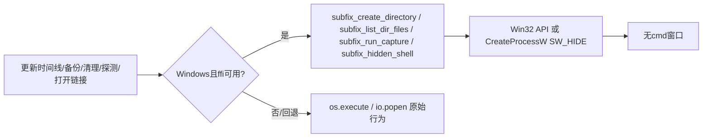

## 用户需求

- 在 DaVinci Resolve 中点击「更新时间线」或任何涉及时间线字幕轨道的操作（自动备份、清理备份、探测外部命令、打开链接等）时，会不断弹出一个黑色 cmd 命令行窗口（一闪而过或持续闪烁），影响使用。
- 用户确认现象为典型的 `os.execute`/`io.popen` 在无控制台 GUI 程序（DaVinci Resolve）中弹出 cmd 窗口。
- 用户要求范围：**彻底消除全脚本闪窗**——把所有会弹窗的 `os.execute`/`io.popen`（备份、列举、清理、探测命令、打开链接等）统一改为无窗口执行，一劳永逸。

## 核心修复点

- 复用脚本已有的基于 LuaJIT ffi `ShellExecuteW`(SW_HIDE) 的隐藏启动机制（第 124–190 行），补齐缺失的「无窗口目录创建 / 目录列举 / 命令输出捕获 / 打开链接」辅助函数，并替换全部 Windows 闪窗调用点。
- 保持 macOS 分支逻辑不变（macOS 下 `os.execute`/`io.popen` 为正常 shell，不闪窗）。
- 保持「双击跳转」「✎ 弹窗编辑」「常驻字幕编辑框」等已有功能不变，仅做增量替换，不重构无关逻辑。

## 技术栈与约束

- 语言：Lua 5.x / LuaJIT，运行于 DaVinci Resolve 的 Fusion UI Manager（声明式 UI + 事件回调）。
- 硬约束（来自历史修复）：**严禁引入任何顶层 `local`**——之前主 chunk 顶层 local 超过 200 上限曾导致整个脚本加载失败、主窗口打不开；现已降到 0。本次所有新函数必须以全局 `function 名称()` 声明；ffi 的 `cdef`/初始化必须包在「立即执行函数（IIFE）」内（其 `local` 属于函数帧，不占主 chunk 槽位），与现有第 174–190 行模式一致。
- ffi 不可用时必须有 `os.execute`/`io.popen` 回退（与现有 AI 路径一致：回退时可能闪窗但功能可用）。

## 实现方案

### 总体策略

在已有 ffi 隐藏启动区块新增 3 个全局辅助函数 + 改造 `subfix_open_url`，形成统一「无窗口执行」API；然后把全脚本 Windows 上的闪窗 `os.execute`/`io.popen` 调用点逐一替换为这些 API。对不需要子进程返回值的（mkdir/del）用 Win32 直接调用；对需要目录列举/命令输出的用 ffi 直接枚举或隐藏管道捕获，避免每次弹窗。

### 关键技术决策

1. **`subfix_create_directory(path)`**：优先用 ffi `CreateDirectoryW`（无子进程、同步、无闪窗）；macOS 或 ffi 不可用时回退 `os.execute('mkdir -p ... ' .. '2>/dev/null')`。替代所有 `os.execute('mkdir ...')`。
2. **`subfix_list_dir_files(dir, pattern, limit)`**：优先用 ffi `FindFirstFileW`/`FindNextFileW`/`FindClose` 直接枚举（无子进程、最快——因为 `list_backup_files` 在每次备份和刷新列表时都会被调用，必须高效）；按 `pattern`（通配）过滤、按文件名排序、受 `limit` 约束；回退 `io.popen('dir /b /o-d ...')`。替代 `list_backup_files` 内的 `io.popen('dir ...')`。
3. **`subfix_run_capture(cmd)`**：ffi `CreateProcessW` + `STARTUPINFO.wShowWindow = SW_HIDE` + 将子进程 stdout 重定向到匿名管道，读取后返回 `(ok, output)`；回退 `io.popen(cmd .. " 2>&1")`。`run_shell_capture` 直接改调用它，其全部调用点（探测 ffmpeg、Python、AI/规整/音频等）自动受益。
4. **`subfix_open_url(url)`**：改用已有的 `subfix_hidden_shell(url, "")`（即 `ShellExecuteW` "open"），去掉 `cmd /c start`，避免弹窗。

### 性能与可靠性

- `FindFirstFileW` 枚举比每次 `dir` 起进程快且零窗口，`list_backup_files` 高频调用收益明显。
- `CreateProcessW` 管道捕获比 `io.popen` 略重（一次进程启动 + 管道读取），但 `run_shell_capture` 均为一次性探测/命令，可接受；设置合理超时与 `io.close` 兜底，避免句柄泄漏。
- 所有新增函数保持纯声明式/无副作用，失败回退到原始行为，不引入新报错路径。

## 实现注意（防回归）

- 新增 ffi `cdef` 与 `CreateDirectoryW`/`FindFirstFileW`/`CreateProcessW` 等声明必须放入 IIFE，函数内 `local` 不计入主 chunk。
- 替换 `CleanBtn`(22201) 的 `del /Q /F` 时，用「先 `subfix_list_dir_files` 列举 `*.srt` → 循环 `os.remove`」或 ffi `DeleteFileW`，避免控制台；manifest 已用 `os.remove`。
- `run_shell_capture` 的返回签名 `(ok, output)` 必须保持，否则其上 10 处调用点（7594、8859、8889、8904、9278、9974、10070、10161、10347、22288）会受影响；仅替换内部 `io.popen` 实现。
- 改动后必须复跑 `_count_locals_scan.py` 确认 MAIN-CHUNK local total = 0、无函数 > 200，并用 luaparser 校验语法。

## 架构设计

调用关系由「直接 os.execute/io.popen → cmd 窗口」改为「统一无窗口辅助函数 → Win32/SW_HIDE」。

## 目录结构

- `f:\SubFix-main\SubFix-main\SubFix.lua` [MODIFY] 主脚本：
- 第 124–190 行 ffi 区块：新增 `subfix_create_directory`、`subfix_list_dir_files`、`subfix_run_capture` 的全局函数与对应 ffi `cdef`/IIFE 初始化；改造 `subfix_open_url` 改用 `subfix_hidden_shell`。
- 第 1487 `ensure_backup_directory`：两处 `os.execute('mkdir ...')` → `subfix_create_directory`。
- 第 1529 `list_backup_files`：`io.popen('dir ...')` → `subfix_list_dir_files`。
- 第 6342 `run_shell_capture`：内部 `io.popen` → `subfix_run_capture`（签名不变）。
- 第 8877/8878、17984/17985、22143/22144 等 `SUBFIX_AUDIO_ALIGN.timeline_audio_mix_temp_dir`、双语导入目录创建：`os.execute('mkdir ...')` → `subfix_create_directory`。
- 第 22201 `CleanBtn`：`del /Q /F` → 列举后 `os.remove` 循环（或 `DeleteFileW`）。
- 部署副本在验证后同步到 `C:\Users\10840\AppData\Roaming\Blackmagic Design\DaVinci Resolve\Support\Fusion\Scripts\Utility\SubFix\SubFix.lua`。

## 关键代码结构

- `function subfix_create_directory(path)` —— 全局；ffi `CreateDirectoryW` 创建目录，mac/无 ffi 回退 `os.execute('mkdir -p ... ' .. '2>/dev/null')`；返回是否成功（布尔）。
- `function subfix_list_dir_files(dir, pattern, limit)` —— 全局；ffi `FindFirstFileW`/`FindNextFileW`/`FindClose` 枚举并筛选通配 `pattern`、按名排序、截断到 `limit`；回退 `io.popen('dir /b /o-d ...')`；返回文件路径数组（含完整路径）。
- `function subfix_run_capture(cmd)` —— 全局；ffi `CreateProcessW`（`wShowWindow = SW_HIDE`，stdout 重定向管道）执行 `cmd`，读取输出；回退 `io.popen(cmd .. " 2>&1")`；返回 `(ok, output)`。

## Agent Extensions

### SubAgent

- **code-explorer**
- Purpose: 在约 6.5 万行的 SubFix.lua 中精确核对全部 Windows 闪窗调用点（os.execute/io.popen 行号与上下文），确认 ffi IIFE（第 174–190 行）结构以便安全插入新 cdef/初始化，并校验替换后无遗漏、无顶层 local 引入。
- Expected outcome: 输出完整的「待替换调用点清单 + ffi 插入安全位置」，供编辑步骤直接执行，避免误改 macOS 分支或漏改任一闪窗点。