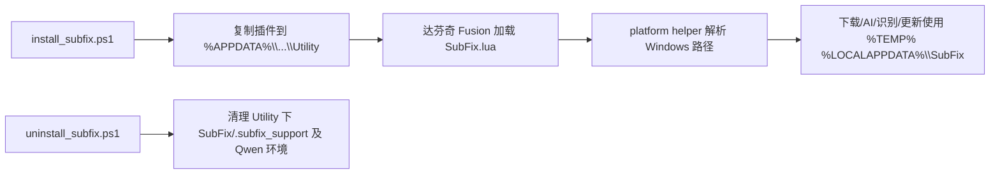

## 用户需求

把当前仅支持 macOS 的 DaVinci Resolve Fusion Lua 插件 SubFix 改造为可在 Windows 上运行的版本。要求：所有 macOS 专属路径（/tmp、HOME、~/Library/Application Support、/opt/homebrew、/usr/bin/osascript 等）统一改为 Windows 兼容，覆盖下载、AI 校对、本地 Qwen 识别等全部功能；并提供替代 macOS .pkg / .command 的 Windows 安装、卸载与打包脚本，部署到 Windows 版达芬奇脚本目录。

## 产品概述

SubFix 是达芬奇字幕插件，Lua 由 Fusion 解释执行，没有传统“编译”步骤。所谓“Windows 版本”= 代码路径与系统调用跨平台化 + 提供 PowerShell 安装/卸载/打包脚本。其中“下载功能”泛指一切会落盘到 macOS 专属路径的能力（curl 响应临时文件、模型与依赖缓存、更新器、ASR 环境），统一改用 Windows 路径。

## 核心功能

- 跨平台路径解析：临时目录、用户主目录、达芬奇脚本目录、venv Python 路径在 Windows/macOS 下均正确。
- 下载/AI/识别/更新功能在 Windows 下使用 %TEMP%、%USERPROFILE%、%APPDATA%、%LOCALAPPDATA% 等系统路径。
- 打开外部 URL、设置字幕轨道等系统调用在 Windows 下以 cmd/PowerShell 等价实现，无等价能力时优雅降级。
- Windows 安装脚本：把插件文件部署到 Windows 达芬奇用户级/系统级脚本目录。
- Windows 卸载脚本：安全移除已安装插件及本地 Qwen 环境，保留用户字幕备份。
- Windows 打包脚本：生成可分发 ZIP（替代 macOS pkgbuild/ditto/xcrun）。

## 技术栈

- Lua 5.x（达芬奇 Fusion 内置解释器，无需编译）；Python 3.12（内置运行时/venv）；PowerShell 5.1+ 或 7（Windows 部署脚本）。
- 严格复用现有项目文件结构与命名，不引入新的运行时或第三方库。

## 实现方案

- 新增“跨平台路径与系统调用辅助”逻辑，用 `package.config:sub(1,1)` 判断路径分隔符、`os.getenv` 区分平台，集中处理临时目录、主目录、达芬奇脚本目录、venv Python 路径、打开 URL、osascript 降级。
- 逐文件替换硬编码 macOS 路径与 shell 调用；Python 侧用 `platform.system()` 与环境变量做分支。
- 安装/卸载/打包用 PowerShell 重写，目标路径映射为 `%APPDATA%` / `%ProgramData%` 下的达芬奇脚本目录，并保留 macOS 路径作为非 Windows 分支，避免破坏现有 macOS 用户。

## 实现要点

- Windows 临时目录取 `os.getenv("TEMP")`/`"TMP"`/`"TMPDIR"`，回退 `C:\Windows\Temp\`；主目录取 `USERPROFILE` 回退 `HOME`。
- `/usr/bin/osascript` 的 JXA 设置字幕轨道在 Windows 无直接等价，Windows 分支降级为 no-op 并提示用户手动切换字幕轨；打开 URL 用 `cmd /c start "" "url"` 替代 `/usr/bin/open`。
- venv Python：Windows 为 `Scripts\python.exe`，macOS 为 `bin/python`；捆绑运行时的 `runtime/python/bin/python3` 同理。
- `subfix_asr_transcribe.py` 的 ffmpeg 发现路径移除 `/opt/homebrew`、`/usr/local`、`~/.local/bin` 等 macOS 专属项，改为优先捆绑 `bin/ffmpeg`、再查 PATH 与 Windows 常见位置。
- 打包脚本中捆绑的 Python runtime（macOS arm64）、qwen3-asr.cpp 构建、ffmpeg 均为平台专属二进制：Windows 包需改用 Windows 构建，build 脚本参数化（如 `PYTHON_RUNTIME_URL_WIN`、`QWEN_BUILD_WIN`），或改为依赖用户已装 Python/ffmpeg。
- 性能/可靠性：路径解析为纯字符串操作，无额外开销；安装/卸载脚本先做存在性探测与 dry-run，删除范围仅限 SubFix 自有条目，保留用户项目与备份。

## 架构设计

数据流：用户运行 `install_subfix.ps1` → 复制 `SubFix.lua`/`生成选区字幕.lua`/`.subfix_support/*` 到 `%APPDATA%\Blackmagic Design\DaVinci Resolve\Fusion\Scripts\Utility` → 达芬奇 Fusion 加载 Lua → 运行时经 platform helper 解析 Windows 路径 → 下载/AI/识别/更新功能使用 `%TEMP%` 与 `%LOCALAPPDATA%\SubFix`。卸载脚本反向清理上述条目。



## 目录结构

```
SubFix.lua                                   # [MODIFY] 新增跨平台 helper；替换 /tmp、HOME、~/Library/...、venv python(/bin/python)、osascript(设轨) 等
生成选区字幕.lua                              # [MODIFY] shebang 与系统调用改为跨平台；引入 helper
.subfix_support/
  subfix_generate_selection_core.lua         # [MODIFY] /usr/bin/osascript(87)、/usr/bin/open(2383)、home_dir/.../Library(367) 改为跨平台
  subfix_update.py                           # [MODIFY] USER_UTILITY_ROOT/SYSTEM_UTILITY_ROOT 加 Windows 分支(%APPDATA%/%ProgramData%)；docstring 去“macOS”
  subfix_qwen_local_manager.py               # [MODIFY] Path.home()/Library/Application Support/SubFix(594)→%LOCALAPPDATA%\SubFix；legacy /bin/python(176)→Scripts\python.exe；hf cache 加 Windows 位置
  subfix_process_group.py                    # [MODIFY] 审计并替换其中的 macOS 专属路径/shell 调用
subfix_asr_transcribe.py                     # [MODIFY] ffmpeg 发现列表移除 macOS 专属路径，加 Windows 兼容发现逻辑
install_subfix.ps1                           # [NEW] Windows 安装器：解析 DR 脚本目录、建 SubFix/ 与 .subfix_support/、复制全部文件、处理权限
uninstall_subfix.ps1                         # [NEW] Windows 卸载器：探测并清理用户/系统 DR 脚本目录与 %LOCALAPPDATA%\SubFix 下 Qwen 环境，dry-run 确认
build_pkg_win.ps1                            # [NEW] Windows 打包：复制源文件到发布布局并生成可分发 ZIP（替代 build_pkg.sh 的 pkgbuild/ditto）
setup_asr_env.ps1                            # [NEW] Windows 版 ASR 环境初始化（venv + pip 安装 qwen-asr），替代 setup_asr_env.sh
README.md                                    # [MODIFY] 新增 Windows 安装/路径/限制说明
```

## 关键代码结构

核心为跨平台辅助函数（在 SubFix.lua 与 生成选区字幕.lua 中复用，或通过 `.subfix_support` 共享加载）：

```
SUBFIX_IS_WINDOWS = (package.config:sub(1, 1) == "\\")

function subfix_temp_dir()            -- 返回带结尾分隔符的临时目录（Windows %TEMP% / macOS /tmp/）
function subfix_home_dir()            -- USERPROFILE 或 HOME
function subfix_dr_utility_root()     -- 达芬奇用户级脚本目录：Windows %APPDATA%\...\Utility / macOS ~/Library/...\Utility
function subfix_support_dir()         -- .subfix_support 绝对路径
function subfix_venv_python()         -- Windows Scripts\python.exe / macOS bin/python
function subfix_open_url(url)         -- Windows: cmd /c start "" url；macOS: /usr/bin/open
function subfix_set_subtitle_track()  -- Windows: 降级 no-op 并提示；macOS: osascript JXA
```

## Agent Extensions

### SubAgent

- **code-explorer**
- 用途：在改造前全面审计仓库内剩余的 macOS 专属路径与 shell 调用（chmod、osascript、/tmp、~/Library、/opt/homebrew、bin/python 等），定位所有待替换点。
- 预期结果：产出完整的待修改点清单，避免遗漏导致 Windows 运行报错。