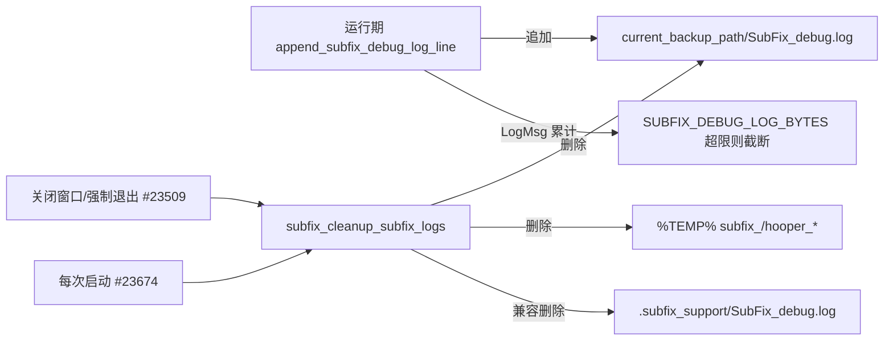

## 用户需求

检查 SubFix.lua，重点排查：冗余代码、未使用代码、潜在 BUG；并确认日志/报错文件是否在关闭达芬奇后自动删除，防止无限生成占据磁盘空间。所有改动不得影响正常功能。

## 核查结论

- 临时文件（%TEMP% 下 `subfix_`/`hooper_` 前缀的 `.cmd/.ps1/.out/stdout/pid/done`，含 AI 请求的 `hooper_curl_*` 与命令回放 `subfix_cap_*`）：已由 `subfix_cleanup_subfix_logs()` 在「关闭窗口/退出(#23509)」与「每次启动(#23674)」两处自动清理，跨会话有兜底，不会无限堆积。
- 调试日志存在真实泄漏：`append_subfix_debug_log_line(#13874)` 以追加模式把 `SubFix_debug.log` 写到 `current_backup_path`（备份目录）；而清理函数 `subfix_cleanup_subfix_logs(#486)` 删除的却是 `<utility_root>/.subfix_support/SubFix_debug.log`，该路径从不被写入（死代码）。结果：备份目录中的 `SubFix_debug.log` 永远不被清理、随每次 LogMsg 无限增长 —— 这是用户担心的磁盘空间隐患，需修复。
- 潜在 BUG：`subfix_temp_dir(#61)` 非 Windows 且 `TEMP/TMP/TMPDIR` 全空时 `tmp = ... or subfix_temp_dir()` 会无限递归。
- 冗余代码：`join_path(#1822)` 与 `subfix_pjoin(#42)` 功能重复（分隔符处理略有差异）。

## 技术栈与现状

- 目标文件：`f:\SubFix-main\SubFix-main\SubFix.lua`（单文件 Lua 脚本，运行于 DaVinci Resolve / Fusion 的 LuaJIT 环境）。
- 已有清理机制：`subfix_cleanup_subfix_logs()`（FFI `FindFirstFileA` 枚举 %TEMP% 删 `subfix_`/`hooper_` 前缀；并删除 `.subfix_support/SubFix_debug.log`）、`subfix_remove_temp()`、`subfix_create_directory()`。
- 验证手段：本地已具备 `lua-language-server`（sumneko 3.19.1）可做 `lua-language-server --check` 静态校验；部署用 `install_subfix.ps1`；用 SHA256 比对工作区与安装副本。

## 实现方案

### A. 修复调试日志清理路径不一致（核心，消除磁盘泄漏）

修改 `subfix_cleanup_subfix_logs()` 的日志删除段（#481-489）：除保留对 `.subfix_support/SubFix_debug.log` 的兼容删除外，新增删除真正写入点 `current_backup_path .. "/SubFix_debug.log"`（与 `append_subfix_debug_log_line` 的 `log_path` 完全一致）。`current_backup_path` 为全局变量（#1792/#2245 初始化，#23206 可改），在退出/启动清理时均已赋值。删除全部用 `pcall` 包裹，路径为空或不存在时静默跳过，不影响正常功能。

### B. 调试日志会话内大小上限（防御性，防单次长会话暴涨）

在 `append_subfix_debug_log_line()`（#13862）中引入全局计数器 `SUBFIX_DEBUG_LOG_BYTES`（全局，不占 main chunk local 名额）。规则：累计写入字节超过 ~2MB 时改用 `"w"` 截断重写并归零计数，否则继续 `"a"` 追加。这样即便会话极长、退出清理未及时执行，单文件也被限制在 ~2MB 量级。

### C. 修复 `subfix_temp_dir` 递归兜底（潜在 BUG）

`subfix_temp_dir()`（#58-66）第 61 行 `tmp = SUBFIX_IS_WINDOWS and "C:\\Windows\\Temp" or subfix_temp_dir()`，非 Windows 且环境变量全空时无限自递归。改为 `tmp = SUBFIX_IS_WINDOWS and "C:\\Windows\\Temp" or "/tmp"`，用确定的回退路径彻底消除递归风险。

### D. 冗余代码处置（低风险，选择性）

`join_path(#1822-1836)` 与 `subfix_pjoin(#42-52)` 重复。因 `join_path` 用硬编码 `"/"` 而 `subfix_pjoin` 用 `SUBFIX_PATH_SEP`，二者在 Windows 分隔符上行为略有差异，直接删除/合并可能误伤调用点。方案：先静态核查全部 `join_path` 调用点（仅备份清单路径拼接等少数处），确认安全后再收敛为统一委托；若调用点含平台相关假设，则保留原样并在代码注释中标注为已知冗余，不下改动。

## 实施注意

- 所有文件/路径操作均处于清理或日志路径，且以 `pcall` 包裹，保证异常时主流程不中断。
- 不改动导出、备份、AI 请求等核心功能逻辑；不删除用户数据（备份 SRT、配置、清单均不动）。
- 改动后用 `lua-language-server --check` 校验语法/静态问题；重新部署并比对 SHA256。

## 架构/数据流（清理生命周期）

