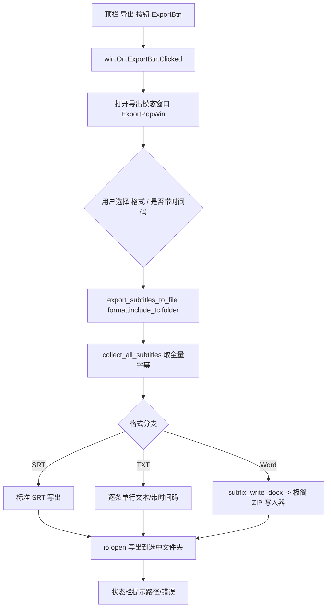

## 用户需求

在 SubFix（DaVinci Resolve 字幕工具）两个窗口顶栏的绿框空白处新增「导出字幕」功能入口，点击后弹出导出窗口，支持将当前载入字幕导出为 SRT、TXT、Word 三种格式。

## 产品概述

- 迷你版与完整版窗口顶栏各新增一个「导出」按钮（绿框位置）。
- 点击按钮弹出导出设置窗口：选择格式（SRT / TXT / Word）、是否带时间码（仅 TXT 与 Word 生效，SRT 始终带时间码）。
- 确认后弹出系统文件夹选择器，自动命名文件并写出，状态栏提示最终路径。

## 核心特性

- 顶栏新增「导出」按钮，两个窗口共用同一处理函数。
- 导出范围固定为当前载入的全部字幕（忽略选区/全片模式）。
- SRT：标准字幕文件（序号 + 时间码 + 文本）。
- TXT / Word：可勾选「带时间码」，带时间码时每条单行 `[n] 00:00:05:14 → 00:00:08:05 | 文本内容`；不带时仅文本。
- Word 输出为标准 .docx（由 Lua 内置极简 ZIP 写入器生成，无外部依赖）。
- 保存路径通过系统文件夹选择器选择，文件自动命名为 `HooperAI_导出_月日_时分秒.扩展名`，导出后状态栏提示路径，失败有明确错误提示。

## 技术栈

- 语言/运行环境：Lua（DaVinci Resolve Fusion 脚本环境，UI 使用 Fusion UIManager）。
- 复用现有样式常量 `SUBFIX_BTN_SECONDARY`（原生深灰、5px 圆角），与相邻按钮观感一致。
- 文件写出使用 Lua 标准库 `io.open`；文件夹选择复用 `fusion:RequestDir("")`。
- Word 生成使用纯 Lua 实现的极简 ZIP（store 无压缩）写入器，零外部依赖。

## 实现方案

### 总体策略

在两个窗口顶栏插入「导出」按钮（ID 统一为 `ExportBtn`），其点击事件打开一个模态导出窗口（参照现有 `AIConfigPopWin` / `NormalizeLengthConfigWin` 的 `dispatcher:AddWindow` 写法）。导出窗口收集「格式 + 是否带时间码」后，调用统一导出核心 `export_subtitles_to_file(format, include_tc, folder)`，按格式写出文件并回写状态栏。

### 关键决策与权衡

1. **复用而非新建样式**：导出按钮套用 `SUBFIX_BTN_SECONDARY`，避免引入新的样式分支，保持与「刷新字幕/检查更新」一致。
2. **始终导出全片**：新增 `collect_all_subtitles()` 直接取 `current_rows`（选区模式未收窄它），并兜底 `subtitle_data_map`/`subtitle_data`，确保与用户确认的「总是导出全片」一致，不复用 `collect_exportable_subtitles` 中可能隐含的范围语义。
3. **txt/word 时间码样式**：采用用户选定的单行带序号样式 `[n] 00:00:05:14 → 00:00:08:05 | 文本`，时间码用 `frames_to_timecode(start_frame, fps)` / `frames_to_timecode(end_frame, fps)`（面板同款 HH:MM:SS:FF）。SRT 时间码仍用 `frames_to_srt_time`（HH:MM:SS,mmm）。
4. **真 docx 的取舍**：放弃外部库（python-docx 在 Fusion Lua 环境不可控），改用纯 Lua 的 store 模式 ZIP 写入器（含 CRC32）。docx 仅需 3 个固定部件（`[Content_Types].xml`、`_rels/.rels`、`word/document.xml`），结构稳定、无压缩即可被 Word/WPS 直接打开。XML 文本需转义 `& < > "`，UTF-8 字节直接入档避免乱码。
5. **保存交互**：复用 `fusion:RequestDir("")` 选文件夹（与现有 📁 按钮完全一致），自动命名，不新增输入框，降低实现与出错面。

### 性能与可靠性

- 字幕条数通常为几十到几百条，逐条字符串拼接与单次 `io.open` 写出，时间复杂度 O(n)，开销可忽略。
- ZIP 采用 store 模式（不压缩），避免 DEFLATE 实现复杂度，且对小型文本文档体积可接受。
- 写出失败统一返回错误信息并在状态栏提示 `❌ 导出失败：<原因>`，不抛出未捕获异常。

## 实现注意事项

- 导出按钮 ID 在两个窗口必须相同（`ExportBtn`），单一 `win.On.ExportBtn.Clicked` 处理，避免重复注册。
- 迷你版：`MiniLoadStatusLabel` 当前 `Weight=1` 占满右侧，需将其改为 `Weight=0` 并在其后插入 `HGap(0,1.0)` + `ExportBtn(Weight=0)`，使按钮落到右侧绿框；完整版在 `CheckUpdateBtn` 之后、`HGap` 之前插入 `ExportBtn`。
- 不改动现有 `ExportSrtBtn`（媒体池导入）逻辑。
- 导出窗口的「是否带时间码」复选框在 SRT 选中时禁用并隐藏说明文字；监听 ComboBox 切换刷新其可用状态。
- 沿用现有 `update_shared_status` / `win:Find("StatusLabel")` 回写状态栏。

## 架构设计



## 目录结构

```
SubFix-main/
└── SubFix.lua   # [MODIFY]
    # 1) 迷你版顶栏布局（约 #18332-18344）：在 MiniLoadStatusLabel 后插入 HGap(0,1.0)+ExportBtn(SUBFIX_BTN_SECONDARY)，并将标签 Weight 改为 0，使导出按钮落在右侧绿框。
    # 2) 完整版顶栏布局（约 #18535-18546）：在 CheckUpdateBtn 之后、HGap 之前插入 ExportBtn(SUBFIX_BTN_SECONDARY)。
    # 3) 新增导出模态窗口 ExportPopWin（仿 AIConfigPopWin #18781）：ExportFormatCombo(ComboBox) + ExportTimecodeCheck(CheckBox) + 导出/取消 按钮 + 条数提示。
    # 4) 新增事件：win.On.ExportBtn.Clicked（打开窗口）、ExportPopWin 内 导出/取消/Combo切换 的处理。
    # 5) 新增导出核心函数与辅助：collect_all_subtitles、export_subtitles_to_file、subfix_write_docx、subfix_zip_store、subfix_crc32、xml 转义工具。
```

## 关键代码结构

```
-- 取全量字幕（始终全片，忽略选区模式），按 start_frame 排序
function collect_all_subtitles()

-- 统一导出入口；format: "srt"|"txt"|"docx"，include_tc 仅 txt/docx 生效；folder 为已选目录；返回 ok, err
function export_subtitles_to_file(format, include_tc, folder)

-- 生成标准 docx：paragraphs 为字符串数组，每条为一段落；内部调用 subfix_zip_store
function subfix_write_docx(path, paragraphs)

-- 极简 ZIP（store 无压缩）写入：files = { {name=, data=}, ... }；返回 ok, err
function subfix_zip_store(path, files)

-- CRC32（IEEE）实现，供 ZIP 中央目录使用
function subfix_crc32(data)
```